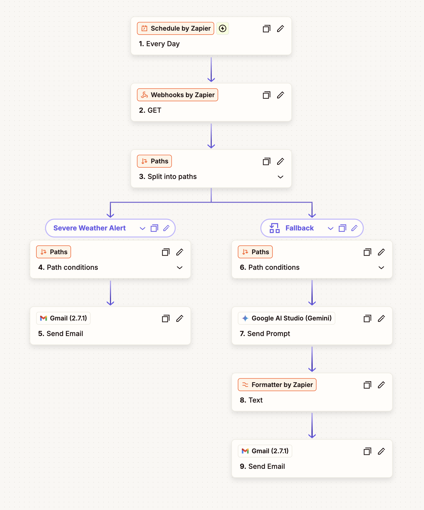
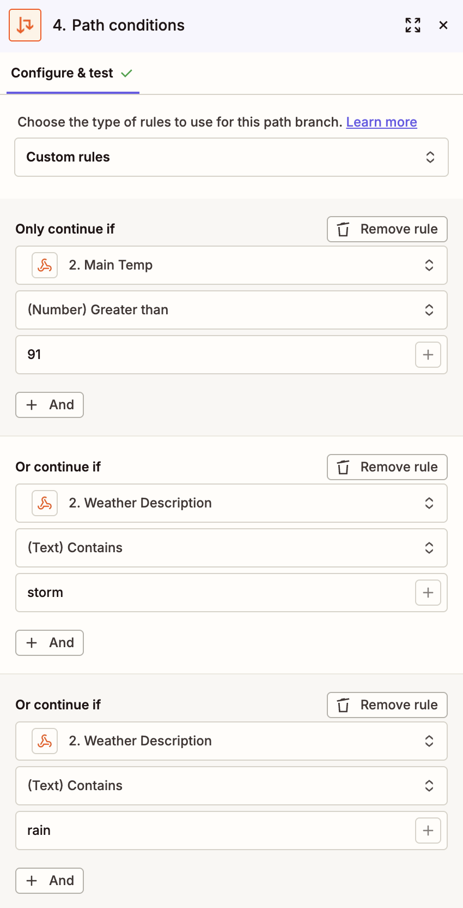
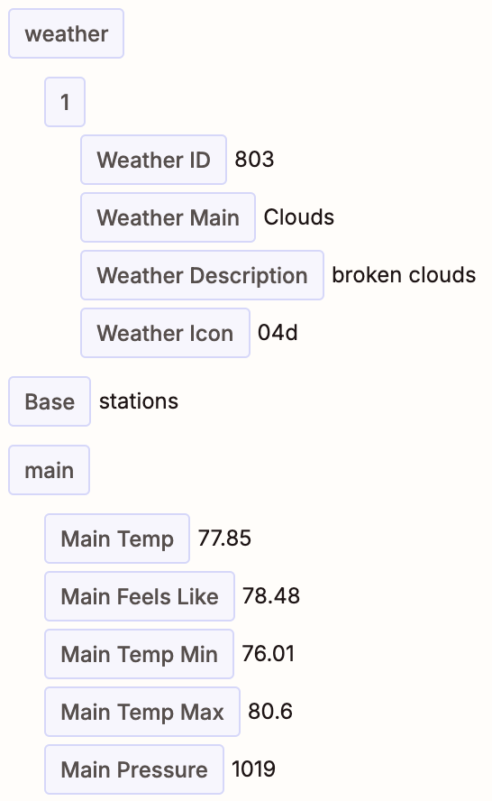
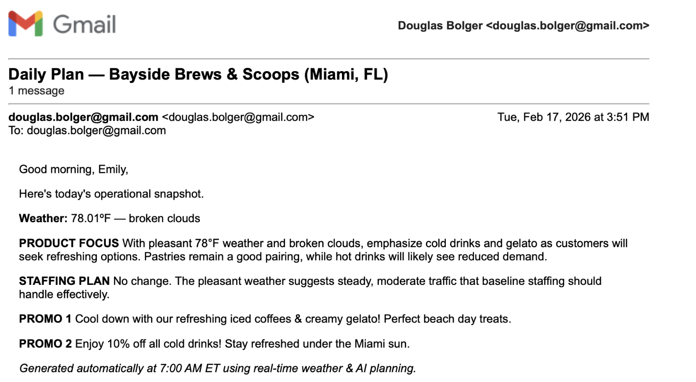

# Severe Weather Alert Automation

Automation workflow demonstrating threshold-based monitoring logic and automated alert delivery using conditional evaluation and external data integration.

---

## Overview

This project demonstrates applied workflow automation by monitoring real-time weather data against predefined safety thresholds and triggering automated alerts when conditions exceed configured limits. The system reduces manual monitoring requirements and improves response readiness.

---

## Problem

Operations teams lacked timely notification when severe weather conditions exceeded safety thresholds. Manual dashboard monitoring delayed response planning and increased operational risk.

---

## Solution

Designed an automated monitoring workflow that:

- Retrieves weather data from an external API  
- Evaluates predefined temperature and severity thresholds  
- Applies conditional logic to determine alert criteria  
- Triggers structured email notifications when conditions are met  
- Allows configurable threshold adjustments for testing and edge-case validation  

---

## Architecture (High-Level Flow)

1. System polls weather API at defined intervals  
2. Retrieved data is parsed and evaluated  
3. Conditional logic checks against configured thresholds  
4. If criteria are met, automated email alert is triggered  
5. Workflow logs execution for monitoring and validation  

---

## Tech Stack

- Zapier / Make (automation workflow)  
- Weather API integration  
- Conditional logic filters  
- Email automation  
- Google Sheets (data logging / threshold tracking)  

---

## Key Concepts Demonstrated

- Threshold-based automation logic  
- Conditional branching workflows  
- External API integration  
- Automated alert systems  
- Edge-case and testing validation  

---

## Notes

This repository documents workflow design and automation logic. No API keys or proprietary data are included.

## Screenshots

### Workflow Architecture

### Threshold & Path Logic

### Weather API Response Mapping

### Generated Operational Email

